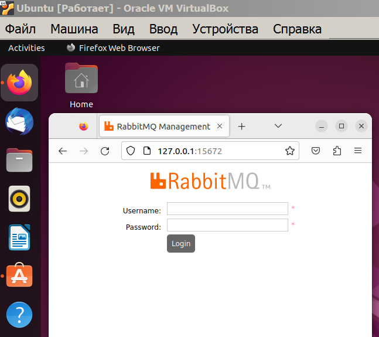

<a href="/README.md">вернуться к оглавлению</a>

<b>Подготовка к сборке проекта</b>   

Проверяем компоненты, которые будут нужны при сборке 
(сборка и запуск будет происходить в Ubuntu 22.04)  

**Git для клонирования проектов с гита**.
<pre>
user1@ubuntu:~$ git --version
git version 2.34.1
</pre>

**Docker и Docker Compose**
<pre>
user1@ubuntu:~$ docker --version
Docker version 23.0.4, build f480fb1
user1@ubuntu:~$ docker-compose --version
Docker Compose version v2.18.0
</pre>

**Подготавливаем RabbitMQ**  
Посмотрим, есть ли образ  RabbitMQ у нас в системе?
<pre>
user1@ubuntu:~$ docker images
REPOSITORY       TAG       IMAGE ID       CREATED         SIZE
nginx            alpine    4937520ae206   3 weeks ago     41.4MB
hello-world      latest    feb5d9fea6a5   21 months ago   13.3kB
</pre>

Если образа нет, попробуем  загрузить ("спулить") образ в локальную систему  
с докерхаба 
<pre>
user1@ubuntu:~$ docker pull rabbitmq:management
management: Pulling from library/rabbitmq
9d19ee268e0d: Pull complete
...
dd868163ea9f: Pull complete
Digest: sha256:fa27e4a92d96ffe5f747c80a39b0bb58cca6e97b9e3f0792b98e1e9d91a6fabe
Status: Downloaded newer image for rabbitmq:management
docker.io/library/rabbitmq:management
</pre>

Повторно проверяем наличие RabbitMQ образа, убеждаемся, что все скачалось
<pre>
user1@ubuntu:~$ docker images
REPOSITORY       TAG          IMAGE ID       CREATED         SIZE
nginx            alpine       4937520ae206   3 weeks ago     41.4MB
rabbitmq         management   1f11da51bb48   5 weeks ago     256MB (вот он)
hello-world      latest       feb5d9fea6a5   21 months ago   13.3kB
</pre> 

Также можно проверить запускается ли образ (контейнер) и увидеть  
его отображение его работы в браузере   
Запускаем образ (контейнер) в терминале  
`user1@ubuntu:~$ docker run --rm -p 15672:15672 rabbitmq:management`

После этого открываем браузер и идем по ссылке: 
`http://127.0.0.1:15672/`

Результат выполнения вызова сервиса RabbitMQ

  

После проверки работоспособности прерываем работу контейнера: 
`CTRL+C` 

Подгружаем в локальную систему образы **maven и openjdk** 
(в том числе на тот случай, если во время сборки не будет доступа к Docker Hub) 
<pre>
user1@ubuntu:~$ docker pull maven:3.8-openjdk-17
user1@ubuntu:~$ docker pull openjdk:17.0.2-jdk
</pre>

После успешного добавления нужных образов в Ubuntu добавляем Dockerfile в корень  
каждого из проектов с указанием ссылок на эти образы и инструкциями  
по сборке и запуску.  

Примечание. Следите за количеством и объемом образов докера. Убирайте лишние образы,  
они занимают много места.

**Postman** 
Также для тестирования нам понадобится Postman, который мы можем легко 
найти и установить с помощью графического интерфейса приложения  
Ubuntu Software (аналога Установка и удаление программ в Windows)